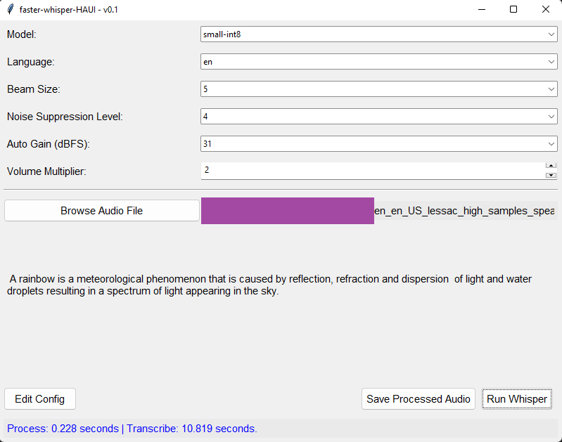

# faster-whisper-HAUI

<a href="https://www.buymeacoffee.com/Nerivec" target="_blank"></a>

A simple UI for Home Assistant's faster-whisper (config as close as possible).
Allows fast testing of audio processing with various settings as configurable in Home Assistant / ESPHome.

WARNING: This is intended for debugging/testing purposes. Since the logic is adapted from Home Assistant & related, if the logic changes there, this will need to be refactored to "match" again. PRs welcomed; also to improve "matching" with Home Assistant/ESPHome logic.

NOTE: `faster_whisper` folder is from [wyoming-faster-whisper](https://github.com/rhasspy/wyoming-faster-whisper/tree/master/wyoming_faster_whisper/faster_whisper).



# Features

- Models & configs from Home Assistant / ESPHome. Models downloaded from [same repository](https://github.com/rhasspy/models/releases/tag/v1.0).
  - "auto" `language` detection supported.
- Save processed audio (without running transcribe) to identify differences with original.
  - Allows to tweak config for ESPHome according to recorded output of microphones.
- Timing of various executions (with more details in logs).
  - Can't compare to Home Assistant's, but allows to evaluate the impact of various configs on a per-machine basis.
- `tkinter` used for UI to limit package requirements.
- _Bugs?_

# Install

Python must be installed (3.12 required for Windows if using below `whl`).

```
pip install -r requirements.txt
```

## Windows

If you are on a Windows machine, `webrtc-noise-gain==1.2.3` currently does not compile ([PR](https://github.com/rhasspy/webrtc-noise-gain/pull/15)).
You can used the attached `whl` in the meantime. It was compiled using Python 3.12 on Windows 11 (Build Tools 2022) with the aforementioned PR included. Or recompile it on your machine using the PR.
Install this before `requirements.txt` or remove the line in there.

```
pip install webrtc_noise_gain-1.2.3-cp312-cp312-win_amd64.whl
```

# Usage

```
python faster_whisper_haui.py
```

A `debug.log` file is automatically created. You can get more details on previous executions as needed.
Rest is self-explanatory...